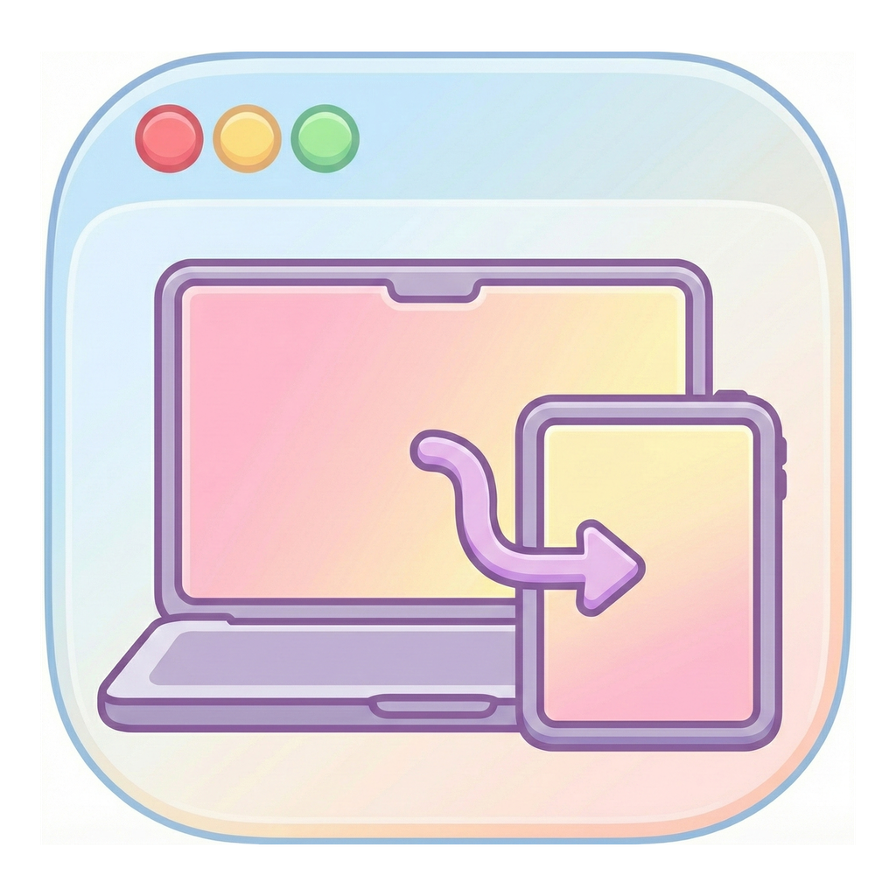
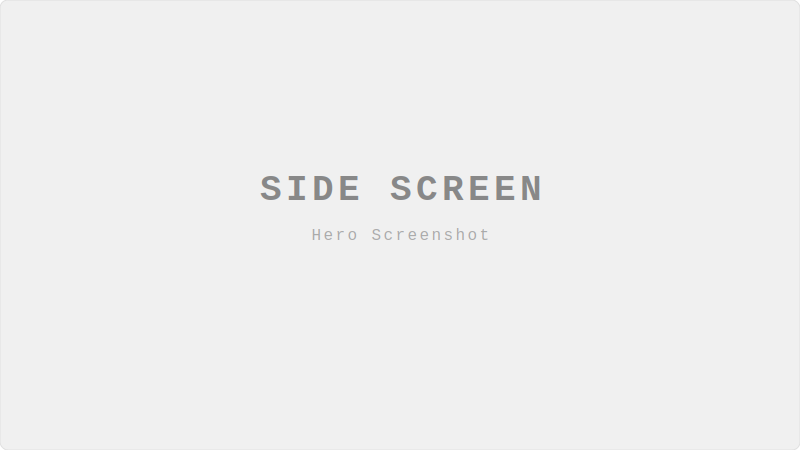
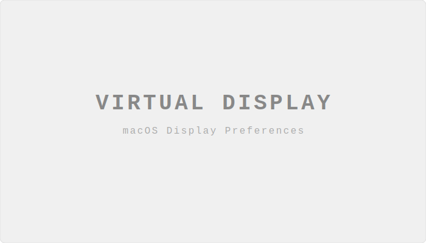
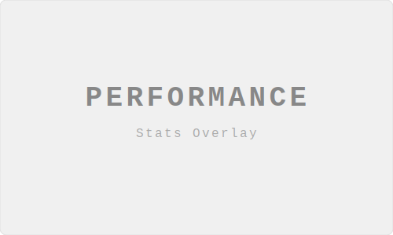
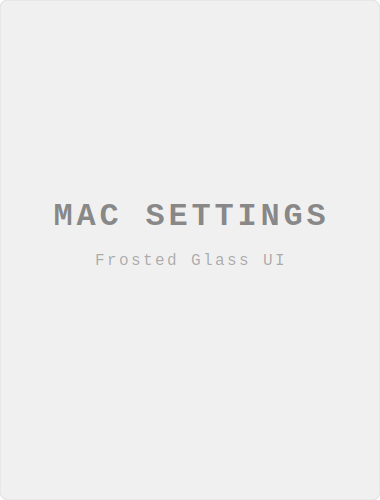
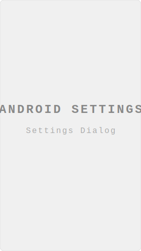

<a id="readme-top"></a>

<div align="center">



<h1>Side Screen</h1>

<p><em>Turn your Android tablet into a second display for macOS via USB-C</em></p>

<p>
  
  <a href="https://github.com/tranvuongquocdat/SideScreen/releases/latest">
    
  </a>
  <a href="https://github.com/tranvuongquocdat/SideScreen/blob/main/LICENSE">
    
  </a>
  <a href="https://github.com/tranvuongquocdat/SideScreen/stargazers">
    
  </a>
</p>


</div>

---

<!-- PLACEHOLDER: Hero screenshot or GIF
     📸 CAPTURE INSTRUCTIONS:
     - Show your Mac screen + Android tablet side by side
     - Display should show a window dragged onto the tablet
     - GIF is ideal: record ~5 seconds of dragging a window onto the tablet
     - Resolution: 800-1000px wide
     - Save to: resources/screenshots/hero.png (or hero.gif) -->
<div align="center">
  <!-- Replace with resources/screenshots/hero.png after capturing -->
  
</div>

---

## About

**Side Screen** extends your Mac workspace to your Android tablet over USB-C. Unlike wireless solutions that introduce lag, Side Screen uses a direct wired connection with hardware-accelerated H.265 streaming for a responsive, near-native second display experience.

- **H.265/HEVC** hardware encoding (Mac) & decoding (Android)
- **< 30ms latency** over USB-C — smooth enough for productivity and gaming
- **Touch input** with prediction for responsive interaction
- **Zero cloud dependency** — everything runs locally, 100% private

<p align="right"><a href="#readme-top">↑ Back to top</a></p>

---

## Features

### Virtual Display

Create a true virtual display on your Mac. Drag windows to your tablet like a real monitor — not mirroring, but extending.

<!-- PLACEHOLDER: Virtual display screenshot
     📸 CAPTURE INSTRUCTIONS:
     - Show macOS Display Preferences with the virtual display appearing
     - Or show a window being dragged from Mac to tablet
     - Save to: resources/screenshots/feature-virtual-display.png -->
<div align="center">
  <!-- Replace with resources/screenshots/feature-virtual-display.png after capturing -->
  
</div>

### Ultra-Low Latency

Hardware-accelerated H.265 encoding on Mac and decoding on Android. Async pipeline architecture delivers frames in under 30ms.

<!-- PLACEHOLDER: Performance stats screenshot
     📸 CAPTURE INSTRUCTIONS:
     - Show the stats overlay on the Android app while streaming
     - Should display FPS, bitrate, and latency numbers
     - Save to: resources/screenshots/feature-performance.png -->
<div align="center">
  <!-- Replace with resources/screenshots/feature-performance.png after capturing -->
  
</div>

### Touch Support

Use your tablet's touchscreen to interact with macOS. Touch prediction compensates for network latency, making taps and drags feel natural.

### Gaming Mode

Enable Gaming Boost for optimized settings: 50 Mbps bitrate, ultra-low quality encoding, up to 120 FPS.

### Customizable

Configure resolution (up to 1920x1200), frame rate (30–120 FPS), bitrate (10–50 Mbps), and quality presets from either the Mac or Android app.

<!-- PLACEHOLDER: Settings screenshots side by side
     📸 CAPTURE INSTRUCTIONS:
     - Left: macOS settings window (the frosted glass one)
     - Right: Android settings dialog
     - Save to: resources/screenshots/settings-mac.png and settings-android.png -->
<div align="center">
  <!-- Replace with resources/screenshots/settings-mac.png after capturing -->
  
  &nbsp;&nbsp;
  <!-- Replace with resources/screenshots/settings-android.png after capturing -->
  
</div>

<p align="right"><a href="#readme-top">↑ Back to top</a></p>

---

## Requirements

| | macOS Host | Android Client |
|---|---|---|
| **OS** | macOS 14 (Sonoma)+ | Android 8.0 (API 26)+ |
| **Hardware** | Apple Silicon or Intel | H.265 hardware decoder |
| **Connection** | USB-C port | USB-C cable |

---

## Installation

Download the latest release from [**GitHub Releases**](https://github.com/tranvuongquocdat/SideScreen/releases):

- **macOS**: Download `.dmg`, open it, drag Side Screen to Applications
- **Android**: Download `.apk`, install on your tablet

> **Note**: On first launch, if macOS says "damaged", run: `sudo xattr -cr /Applications/SideScreen.app`

<details>
<summary><strong>Build from source (for developers)</strong></summary>

```bash
git clone https://github.com/tranvuongquocdat/SideScreen.git
cd SideScreen

# macOS
cd MacHost && swift build -c release

# Android
cd AndroidClient && ./gradlew assembleDebug
```
</details>

---

## Usage

1. Connect tablet to Mac via **USB-C**
2. Launch **Side Screen** on Mac (runs in menu bar — port forwarding is set up automatically)
3. Open **Side Screen** on tablet → tap **Connect**
4. Done — drag windows to your new display

---

## Configuration

| Setting | Options | Default |
|---------|---------|---------|
| Resolution | 1920x1200, 1920x1080, custom | 1920x1200 |
| Frame Rate | 30, 60, 90, 120 FPS | 60 |
| Bitrate | 10–50 Mbps | 20 Mbps |
| Quality | Low, Medium, High | Medium |
| Gaming Boost | On/Off | Off |

---

## Troubleshooting

<details>
<summary><strong>"SideScreen is damaged" on macOS</strong></summary>

This happens because the app is not notarized by Apple. Run this command to fix it:
```bash
sudo xattr -cr /Applications/SideScreen.app
```
Then open the app again.
</details>

<details>
<summary><strong>"Connection refused" on Android</strong></summary>

The Mac app sets up `adb reverse` automatically when streaming starts. If it still fails, make sure `adb` is installed (via Android SDK or Homebrew: `brew install android-platform-tools`) and your device has USB debugging enabled.
</details>

<details>
<summary><strong>High latency or stuttering</strong></summary>

- Lower resolution or frame rate
- Ensure H.265 hardware codec support on your device
- Use a high-quality USB-C cable (not charge-only)
</details>

<details>
<summary><strong>Virtual display not appearing</strong></summary>

Grant Screen Recording permission: **System Preferences → Privacy & Security → Screen Recording → Enable Side Screen**
</details>

---

## Contributing

Contributions are welcome!

- ⭐ **Star** this repo to help others discover it
- 🐛 **Report bugs** via [Issues](https://github.com/tranvuongquocdat/SideScreen/issues)
- 💡 **Suggest features** via [Issues](https://github.com/tranvuongquocdat/SideScreen/issues)
- 🔧 **Submit PRs** — see [CONTRIBUTING.md](CONTRIBUTING.md)

---

## Support

If Side Screen is useful to you, consider supporting development:

<div align="center">

[](https://buymeacoffee.com/tranvuongqk)
[](https://github.com/sponsors/tranvuongquocdat)

</div>

---

## License

[MIT License](LICENSE) — free for personal and commercial use.

---

<div align="center">

Made with ❤️ by **Tran Vuong Quoc Dat**

[Report Bug](https://github.com/tranvuongquocdat/SideScreen/issues) · [Request Feature](https://github.com/tranvuongquocdat/SideScreen/issues) · [Discussions](https://github.com/tranvuongquocdat/SideScreen/discussions)

</div>
